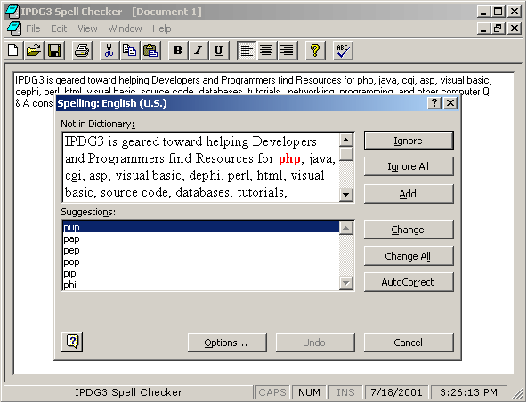



## VB Spell Checker

### Description

This program calls word to spell check from Visual Basic. It creates a Word.Basic object and invokes its methods. I have added a few little features thought the program to answer questions people have asked me in the past this way you have the source. I Wrote this utitly to be able to check my spelling fast without haveing to load programs that would take a lot of system resources.

Requirements: In order to use the spell checking feature in this program you need to have Microsoft Word Installed on your Computer and every computer you want to use this on.
 
### More Info
 

             |
---                |---
**Submitted On**   |2001-07-18 15:19:04
**By**             |[iamtgo3](https://github.com/Planet-Source-Code/PSCIndex/blob/master/ByAuthor/iamtgo3.md)
**Level**          |Intermediate
**User Rating**    |4.3 (13 globes from 3 users)
**Compatibility**  |VB 6\.0
**Category**       |[Complete Applications](https://github.com/Planet-Source-Code/PSCIndex/blob/master/ByCategory/complete-applications__1-27.md)
**World**          |[Visual Basic](https://github.com/Planet-Source-Code/PSCIndex/blob/master/ByWorld/visual-basic.md)
**Archive File**   |[VB Spell C230497182001\.zip](https://github.com/Planet-Source-Code/iamtgo3-vb-spell-checker__1-25191/archive/master.zip)

